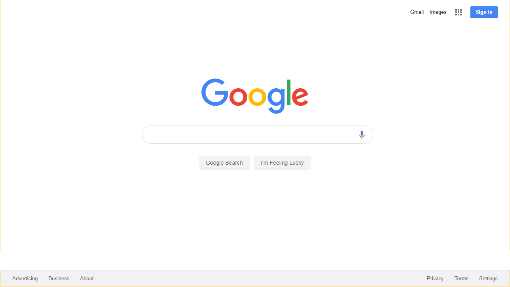
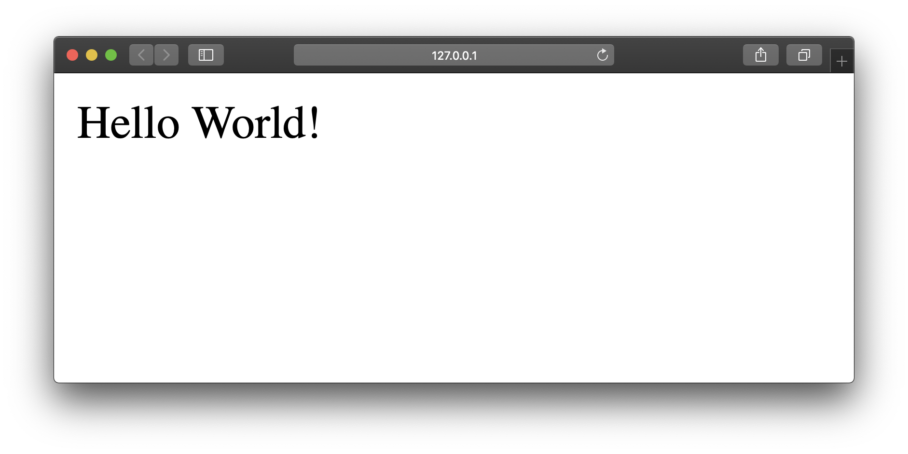
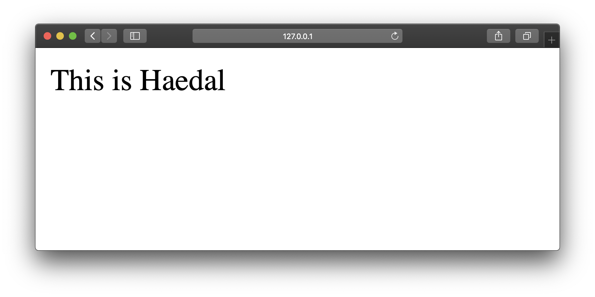
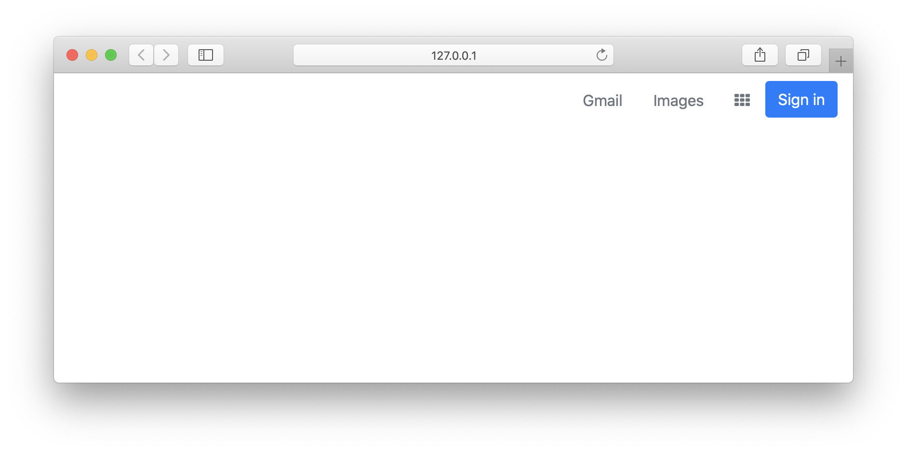
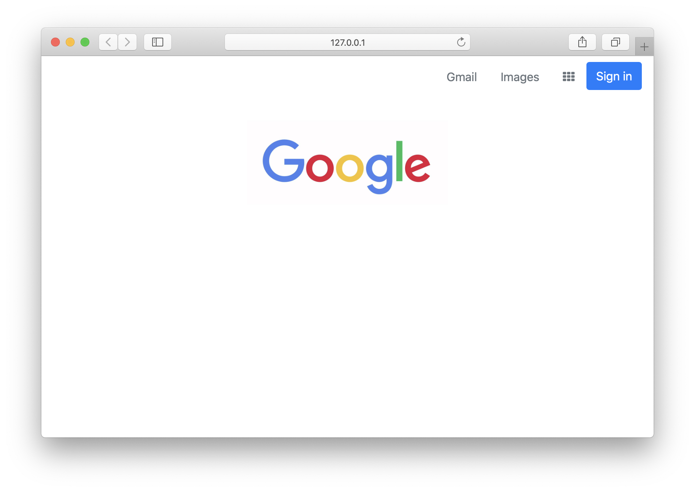
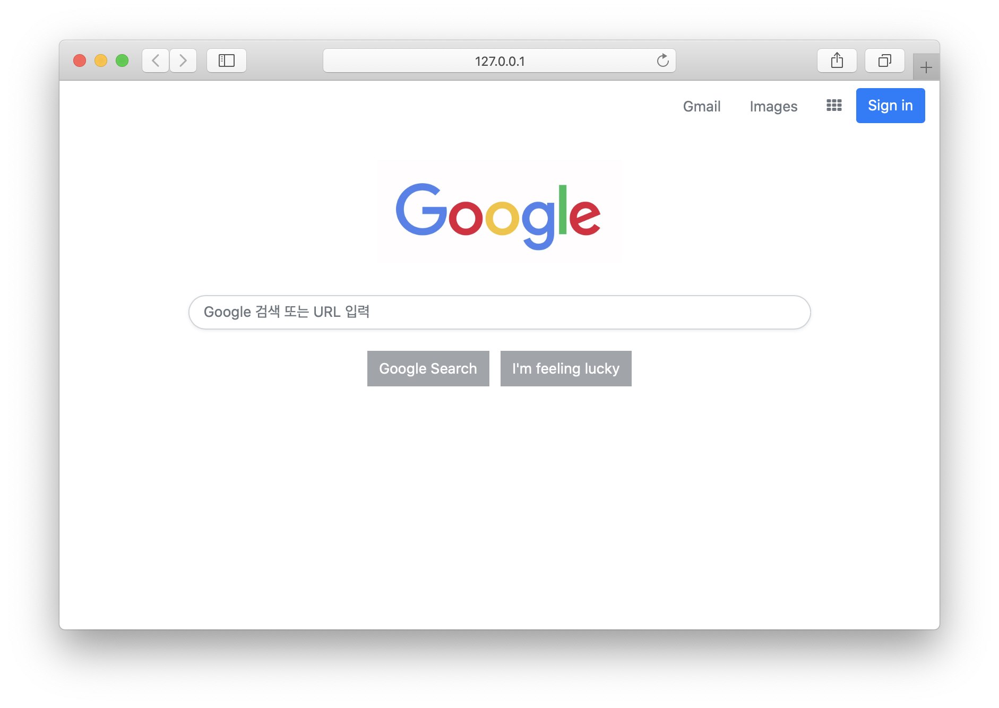
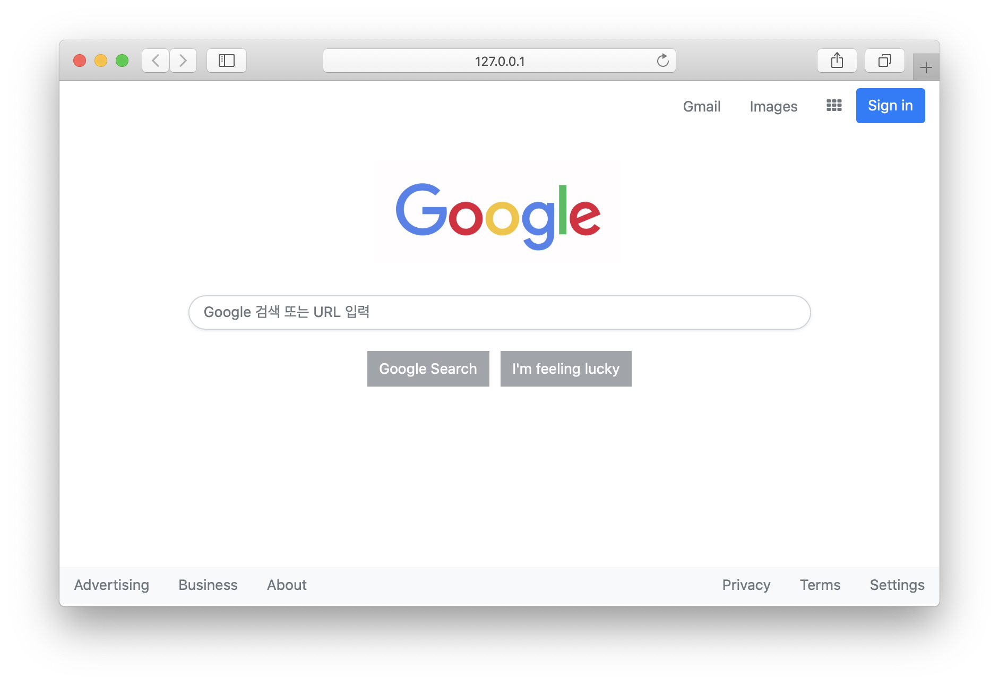

# Fake Google
> 2% 부족한 구글 첫페이지 만들기 



## `Flask`로 간단한 웹서버 키자

파이참 프로젝트를 실행하고 `Flask`를 다운로드 합니다
```bash
$ pip3 install Flask
``` 

점심을 뭐먹을 건지 확인하고 싶으므로,  
`mylunch.py`라는 이름의 파이썬 파일을 만듭니다. 
```bash
$ touch hello.py
``` 

`hello.py`를 통해 서버를 켜보자  
```python
from flask import Flask
app = Flask(__name__)

@app.route("/")
def hello():
    return "Hello World!"
```

```bash
$ FLASK_APP=hello.py flask run
```

서버가 잘 켜지나요?



`FLASK_APP=hello.py flask run` 명령어는 `hello.py` 파일을  
수정할때마다 서버를 껐다 켜야합니다.  
서버를 켜두고 작업하다 수정할때마다 디버그를 할 수 있게 하여   
새로고침할 때 마다 수정사항을 반영합니다 

```bash
$ FLASK_DEBUG=1 FLASK_APP=hello.py flask run
```
[http://127.0.0.1:5000/haedal](http://127.0.0.0:5000/haedal)을 만들어 봅니다 

```python
from flask import Flask
app = Flask(__name__)

@app.route("/")
def hello():
    return "Hello World!"

@app.route("/haedal")
def haedal():
    return "This is Haedal"
```
새로고침하니 수정사항이 반영되나요?


서버를 킬때마다 `$ FLASK_DEBUG=1 FLASK_APP=hello.py flask run` 명령어를 쳐야하면 일이 많겠죠?  
파이썬 파일이니 `python3 hello.py`으로 실행 가능하도록  
명령어를 줄여봅니다

```python
from flask import Flask
app = Flask(__name__)

@app.route("/")
def hello():
    return "Hello World!"

@app.route("/haedal")
def haedal():
    return "This is Haedal"

# Flask를 쉽게 켜자
if __name__ == '__main__':
  app.run(debug=True)
```

```bash
$ python3 hello.py
```
## Fake Google 서버 켜보자


`hello.py`
```python
from flask import Flask, render_template

@app.route("/")
def hello():
    return render_template("index.html")
```

`templates/index.html`
```html
<!doctype html>
<html>
<head>
    <title>Fake Google</title>
</head>
<body>
    <h1>Hello Google</h1>
</body>
</html>
```

## `Bootstrap` 사용

밑단부터 모든 코드를 제작하지 않고 `Bootstrap` 프레임워크를 활용합니다 

```html
<!doctype html>
<html>
<head>
    <title>Fake Google</title>
    <!-- Bootstrap CSS CDN-->
    <link rel="stylesheet" href="https://stackpath.bootstrapcdn.com/bootstrap/4.3.1/css/bootstrap.min.css" integrity="sha384-ggOyR0iXCbMQv3Xipma34MD+dH/1fQ784/j6cY/iJTQUOhcWr7x9JvoRxT2MZw1T" crossorigin="anonymous">
    <!-- font awesome CDN-->
    <link rel="stylesheet" href="https://stackpath.bootstrapcdn.com/font-awesome/4.7.0/css/font-awesome.min.css">
</head>
<body>
    <h1>Hello Google</h1>

    <!--javascript CDN-->
    <script src="https://code.jquery.com/jquery-3.3.1.slim.min.js" integrity="sha384-q8i/X+965DzO0rT7abK41JStQIAqVgRVzpbzo5smXKp4YfRvH+8abtTE1Pi6jizo" crossorigin="anonymous"></script>
    <script src="https://cdnjs.cloudflare.com/ajax/libs/popper.js/1.14.7/umd/popper.min.js" integrity="sha384-UO2eT0CpHqdSJQ6hJty5KVphtPhzWj9WO1clHTMGa3JDZwrnQq4sF86dIHNDz0W1" crossorigin="anonymous"></script>
    <script src="https://stackpath.bootstrapcdn.com/bootstrap/4.3.1/js/bootstrap.min.js" integrity="sha384-JjSmVgyd0p3pXB1rRibZUAYoIIy6OrQ6VrjIEaFf/nJGzIxFDsf4x0xIM+B07jRM" crossorigin="anonymous"></script>
</body>
</html>
```

## `Nav` 만들기
> 맨 위의 바를 만들어봅니다  


### `Nav`

    - 오른쪽 정렬
    - 파란색 버튼
    - 9칸으로 구분된 아이콘(`fontawesome` 사용)



`index.html`
```html
<!doctype html>
<html>
<head>
    <title>Fake Google</title>
    <!-- Bootstrap CSS CDN -->
    <link rel="stylesheet" href="https://stackpath.bootstrapcdn.com/bootstrap/4.3.1/css/bootstrap.min.css" integrity="sha384-ggOyR0iXCbMQv3Xipma34MD+dH/1fQ784/j6cY/iJTQUOhcWr7x9JvoRxT2MZw1T" crossorigin="anonymous">
    <!-- font awesome CDN -->
    <link rel="stylesheet" href="https://stackpath.bootstrapcdn.com/font-awesome/4.7.0/css/font-awesome.min.css">
</head>
<body>
    <!-- Navbar -->
    <ul class="nav justify-content-end py-2 px-3">
      <li class="nav-item">
        <a class="nav-link text-muted" href="#">Gmail</a>
      </li>
      <li class="nav-item">
        <a class="nav-link text-muted" href="#">Images</a>
      </li>
      <li class="nav-item">
        <a class="nav-link text-muted" href="#"><i class="fa fa-th" aria-hidden="true"></i></a>
      </li>
      <li class="nav-item">
        <a class="btn btn-primary" href="#">Sign in</a>
      </li>
    </ul>

    <!--javascript CDN-->
    <script src="https://code.jquery.com/jquery-3.3.1.slim.min.js" integrity="sha384-q8i/X+965DzO0rT7abK41JStQIAqVgRVzpbzo5smXKp4YfRvH+8abtTE1Pi6jizo" crossorigin="anonymous"></script>
    <script src="https://cdnjs.cloudflare.com/ajax/libs/popper.js/1.14.7/umd/popper.min.js" integrity="sha384-UO2eT0CpHqdSJQ6hJty5KVphtPhzWj9WO1clHTMGa3JDZwrnQq4sF86dIHNDz0W1" crossorigin="anonymous"></script>
    <script src="https://stackpath.bootstrapcdn.com/bootstrap/4.3.1/js/bootstrap.min.js" integrity="sha384-JjSmVgyd0p3pXB1rRibZUAYoIIy6OrQ6VrjIEaFf/nJGzIxFDsf4x0xIM+B07jRM" crossorigin="anonymous"></script>
</body>
</html>
```

## Google Logo 추가
> 구글 로고를 가운데 위치시키고 적당한 크기로 만듭니다



`index.html`
```html
<section>
    <div class="container d-flex flex-column justify-content-center">
        <!--Google Logo-->
        
    </div>
</section>

```

## Google Search, Button 추가
> 검색창과 버튼을 만들고 가운데 배치합니다


`index.html`
```html
<section>
    <div class="container d-flex flex-column justify-content-center">
        <!--Google Logo-->
        
        <!--Google Search-->
        <input type="text" class="form-control rounded-pill shadow-sm p-3 mb-4 bg-white rounded" placeholder="Google 검색 또는 URL 입력" aria-label="Text input with segmented dropdown button">
        <!--Button-->
        <div class="mx-auto">
            <button type="button" class="btn btn-secondary rounded-0 d-inline disabled mr-2">Google Search</button>
            <button type="button" class="btn btn-secondary rounded-0 d-inline disabled">I'm feeling lucky</button>
        </div>
    </div>
</section>
```

## footer 만들기
> 하단에 들어갈 footer를 만듭니다


`index.html`
```html
<footer class="d-flex justify-content-between bg-light" style="margin-top:200px">
    <nav class="nav">
      <a class="nav-link disabled" href="#">Advertising</a>
      <a class="nav-link disabled" href="#">Business</a>
      <a class="nav-link disabled" href="#">About</a>
    </nav>
    <nav class="nav">
      <a class="nav-link disabled" href="#">Privacy</a>
      <a class="nav-link disabled" href="#">Terms</a>
      <a class="nav-link disabled" href="#">Settings</a>
    </nav>
</footer>
```

## 최종 코

`hello.py`
```python
from flask import Flask, render_template
app = Flask(__name__)

@app.route("/")
def hello():
    return render_template("index.html")

@app.route("/haedal")
def haedal():
    return "This is Haedal"

# Flask를 쉽게 켜자
if __name__ == '__main__':
  app.run(debug=True)
```

`index.html`
```html
<!doctype html>
<html>
<head>
    <title>Fake Google</title>
    <!-- Bootstrap CSS CDN -->
    <link rel="stylesheet" href="https://stackpath.bootstrapcdn.com/bootstrap/4.3.1/css/bootstrap.min.css" integrity="sha384-ggOyR0iXCbMQv3Xipma34MD+dH/1fQ784/j6cY/iJTQUOhcWr7x9JvoRxT2MZw1T" crossorigin="anonymous">
    <!-- font awesome CDN -->
    <link rel="stylesheet" href="https://stackpath.bootstrapcdn.com/font-awesome/4.7.0/css/font-awesome.min.css">
</head>
<body>
    <!-- Navbar -->
    <ul class="nav justify-content-end py-2 px-3">
      <li class="nav-item">
        <a class="nav-link text-muted" href="#">Gmail</a>
      </li>
      <li class="nav-item">
        <a class="nav-link text-muted" href="#">Images</a>
      </li>
      <li class="nav-item">
        <a class="nav-link text-muted" href="#"><i class="fa fa-th" aria-hidden="true"></i></a>
      </li>
      <li class="nav-item">
        <a class="btn btn-primary" href="#">Sign in</a>
      </li>
    </ul>

    <section>
        <div class="container d-flex flex-column justify-content-center">
            <!--Google Logo-->
            
            <!--Google Search-->
            <input type="text" class="form-control rounded-pill shadow-sm p-3 mb-4 bg-white rounded"placeholder="Google 검색 또는 URL 입력" aria-label="Text input with segmented dropdown button">
            <!--Button-->
            <div class="mx-auto">
                <button type="button" class="btn btn-secondary rounded-0 d-inline disabled mr-2">Google Search</button>
                <button type="button" class="btn btn-secondary rounded-0 d-inline disabled">I'm feeling lucky</button>
            </div>
        </div>
    </section>

    <!--footer-->
    <footer class="d-flex justify-content-between bg-light" style="margin-top:200px">
        <nav class="nav">
          <a class="nav-link disabled" href="#">Advertising</a>
          <a class="nav-link disabled" href="#">Business</a>
          <a class="nav-link disabled" href="#">About</a>
        </nav>
        <nav class="nav">
          <a class="nav-link disabled" href="#">Privacy</a>
          <a class="nav-link disabled" href="#">Terms</a>
          <a class="nav-link disabled" href="#">Settings</a>
        </nav>
    </footer>
    <!--javascript CDN-->
    <script src="https://code.jquery.com/jquery-3.3.1.slim.min.js" integrity="sha384-q8i/X+965DzO0rT7abK41JStQIAqVgRVzpbzo5smXKp4YfRvH+8abtTE1Pi6jizo" crossorigin="anonymous"></script>
    <script src="https://cdnjs.cloudflare.com/ajax/libs/popper.js/1.14.7/umd/popper.min.js" integrity="sha384-UO2eT0CpHqdSJQ6hJty5KVphtPhzWj9WO1clHTMGa3JDZwrnQq4sF86dIHNDz0W1" crossorigin="anonymous"></script>
    <script src="https://stackpath.bootstrapcdn.com/bootstrap/4.3.1/js/bootstrap.min.js" integrity="sha384-JjSmVgyd0p3pXB1rRibZUAYoIIy6OrQ6VrjIEaFf/nJGzIxFDsf4x0xIM+B07jRM" crossorigin="anonymous"></script>
</body>
</html>
```

수고 많으셨습니다 :)